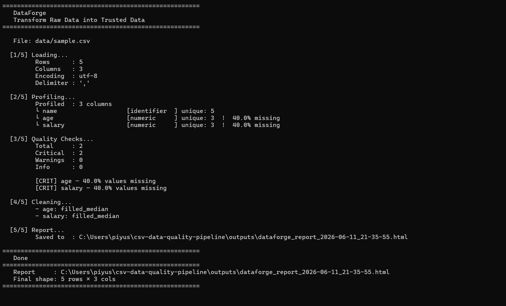
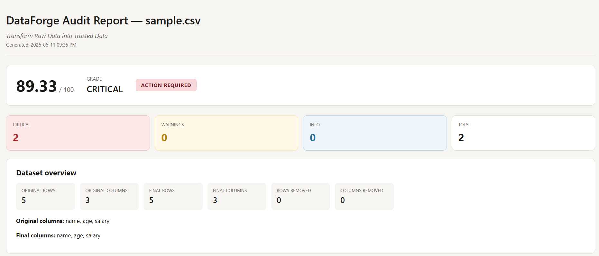
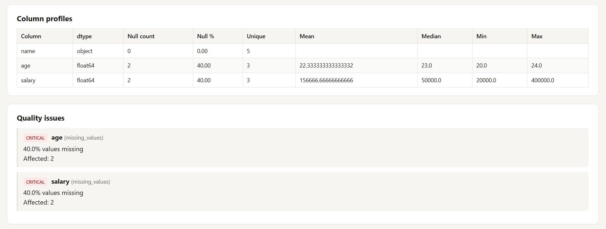
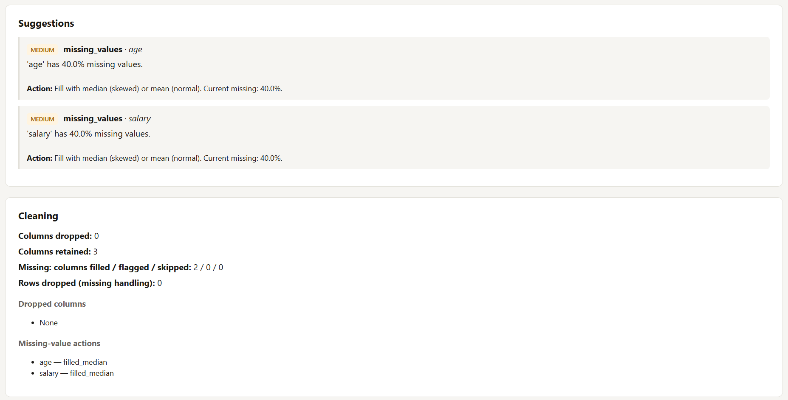
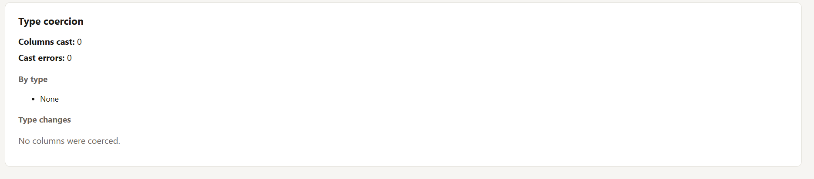

# DataForge


> Transform raw CSV data into trusted, audit-ready datasets.

DataForge is a modular data quality and profiling engine for CSV datasets. It audits tabular data, detects common quality issues, applies configurable cleaning strategies, and generates self-contained HTML audit reports that can be shared with analysts, engineers, and stakeholders.

Status: active development  
Language: Python  
Primary interface: command line  
Primary output: HTML audit report

---

## Problem Statement

CSV files are still the default exchange format for operational data, analytics exports, model inputs, and ad hoc reporting. They are also fragile.

Real-world CSV datasets often contain:

- Missing values hidden across important columns
- Duplicate rows that distort analysis
- Constant or low-value columns
- Incorrectly typed values stored as strings
- Outliers that skew metrics and models
- Unknown encodings or delimiters
- Data quality problems discovered too late in the workflow

Manual inspection does not scale, and one-off cleanup scripts are hard to reuse or audit.

## Solution

DataForge provides a repeatable pipeline for turning raw CSV input into a quality report and a cleaner dataset.

It loads a CSV safely, profiles each column, runs quality checks, computes a quality score, recommends fixes, applies automated cleaning rules, coerces obvious data types, and writes a structured HTML report.

The project is designed as a modular engine rather than a single script. Each stage has a clear responsibility, making it easier to extend, test, and integrate into future APIs or applications.

## Key Features

- CSV loading with encoding detection
- Delimiter detection for comma, semicolon, tab, and pipe-separated files
- Column profiling with inferred types, null counts, unique counts, and numeric statistics
- Missing value detection with warning and critical severity levels
- Duplicate row detection
- Constant column detection
- High-cardinality category detection
- IQR-based numeric outlier detection
- Dataset quality score from 0 to 100
- Actionable suggestions for data cleanup
- Automated cleaning for weak columns and missing values
- Type coercion for numeric, datetime, and boolean-like string columns
- Self-contained HTML audit report
- Command-line interface with quiet, verbose, custom output, and save-clean options
- Configurable thresholds and strategies

## Architecture Diagram

```text
                         +------------------+
                         |   CSV Dataset    |
                         +---------+--------+
                                   |
                                   v
+------------------+     +---------+--------+     +------------------+
| Command Line UI  +---->|      Loader      +---->|    Profiler      |
|   maincsv.py     |     | encoding, sep    |     | column stats     |
+------------------+     +---------+--------+     +---------+--------+
                                   |                        |
                                   v                        v
                         +---------+--------+     +---------+--------+
                         |  Quality Checks  |     | Quality Scorer   |
                         | missing, dupes   |     | score + grade    |
                         +---------+--------+     +---------+--------+
                                   |                        |
                                   v                        v
                         +---------+--------+     +---------+--------+
                         | Suggestions      |     | Cleaner          |
                         | fix guidance     |     | filter + impute  |
                         +---------+--------+     +---------+--------+
                                                            |
                                                            v
                                                  +---------+--------+
                                                  | Type Coercer     |
                                                  | numeric/date/bool|
                                                  +---------+--------+
                                                            |
                                                            v
                                                  +---------+--------+
                                                  | HTML Reporter    |
                                                  | audit report     |
                                                  +------------------+
```

## Installation

Clone the repository:

```bash
git clone <repository-url>
cd csv-data-quality-pipeline
```

Create and activate a virtual environment:

```bash
python -m venv venv
```

On Windows:

```powershell
.\venv\Scripts\Activate.ps1
```

On macOS or Linux:

```bash
source venv/bin/activate
```

Install dependencies:

```bash
pip install -r requirements.txt
```

## Usage Examples

Run an audit on the sample dataset:

```bash
python maincsv.py data/sample.csv
```

Generate a report at a custom path:

```bash
python maincsv.py data/sample.csv --output outputs/customer_audit.html
```

Save the cleaned dataset:

```bash
python maincsv.py data/sample.csv --save-clean outputs/cleaned_data.csv
```

Skip automated cleaning and only audit/profile the dataset:

```bash
python maincsv.py data/sample.csv --skip-clean
```

Show a full column breakdown in the terminal:

```bash
python maincsv.py data/sample.csv --verbose
```

Only print the final summary:

```bash
python maincsv.py data/sample.csv --quiet
```

Use the pipeline from Python:

```python
from src.pipeline.pipeline import run_pipeline

result = run_pipeline(
    filepath="data/sample.csv",
    output_path="outputs/report.html",
    save_clean="outputs/cleaned_data.csv",
)

if result["success"]:
    print(result["summary"])
else:
    print(result["error"])
```

## Sample Output

Terminal output:

```text
======================================================
   DataForge
   Transform Raw Data into Trusted Data
======================================================

   File: data/sample.csv

  [1/5] Loading...
         Rows      : 5
         Columns   : 3
         Encoding  : utf-8
         Delimiter : ','

  [2/5] Profiling...
         Profiled  : 3 columns
         (use --verbose to see full column breakdown)

  [3/5] Quality Checks...
         Total     : 3
         Critical  : 2
         Warnings  : 1
         Info      : 0

  [4/5] Cleaning...
         - age: filled_median
         - salary: filled_median

  [5/5] Report...
         Saved to  : C:\path\to\csv-data-quality-pipeline\outputs\report.html

======================================================
   Done
======================================================
   Report     : C:\path\to\csv-data-quality-pipeline\outputs\report.html
   Final shape: 5 rows x 3 cols
======================================================
```

The HTML report includes:

- Dataset overview
- Quality score and grade
- Severity counts
- Column profile table
- Quality issues
- Suggested actions
- Cleaning summary
- Type coercion summary

## Screenshots

### CLI Execution


### HTML Report Overview


### Dataset Overview


### Quality Issues


### Cleaning Summary


## Roadmap

- Stabilize the public pipeline API
- Add automated test coverage for each pipeline stage
- Expand report templates and visual summaries
- Add JSON export for machine-readable audit results
- Add support for batch processing multiple CSV files
- Package the project for easier installation
- Add configuration files for custom project-level rules
- Provide richer documentation and examples

## Future Improvements

- Schema validation with expected column names and data types
- Custom validation rules for business-specific checks
- More advanced outlier handling strategies
- Data drift comparison between two CSV snapshots
- Integration with databases and cloud object storage
- Web interface for uploading datasets and viewing reports
- API service for automated data quality checks in pipelines
- CI integration for validating datasets before release
- Better logging and observability for production workflows

## Project Structure

```text
csv-data-quality-pipeline/
|-- data/
|   `-- sample.csv         sample CSV dataset
|-- docs/
|   `-- images/            README screenshots and report previews
|-- outputs/               generated reports and cleaned data
|-- src/
|   |-- cli/               command-line interface
|   |-- core/              loader, profiler, quality checks, cleaner, reporter
|   |-- pipeline/          orchestration layer
|   |-- utils/             shared config and exceptions
|   `-- config.py          stable configuration import path
|-- tests/                 test suite
|-- maincsv.py             CLI entry point
|-- requirements.txt       Python dependencies
`-- README.md
```

## Contributing

Contributions are welcome. Good first areas to improve include tests, documentation, report styling, additional quality checks, and packaging.

Before opening a pull request, run the CLI against `data/sample.csv` and confirm that the generated report still renders correctly.
